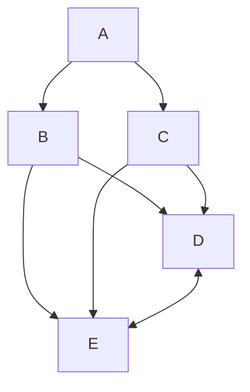

# README.md
You should read me!

# This is an H1
## This is an H2
### This is an H3

| Left column | Right column |
| :--- | ---:|
| Fred | Bedrock |
| Abraham | Springfield |

This is a code block:

```
function test() {
  console.log("notice the blank line before this function?");
}
```
This is a diagram:


